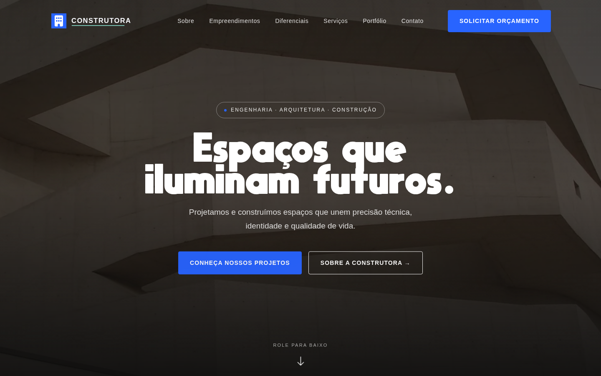
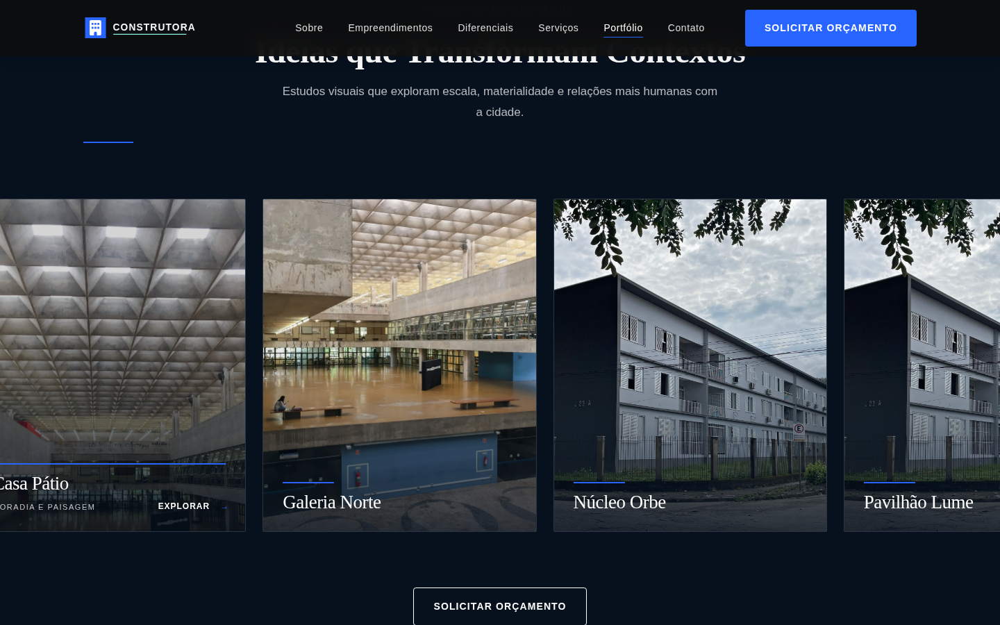
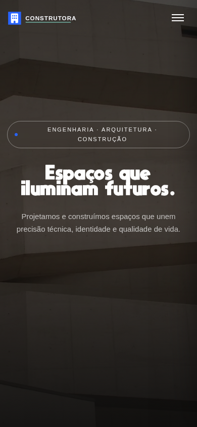

<div align="center">


# 🏗️ Construtora

### A modern construction landing page shaped by architecture, clarity, and purposeful motion.

[](index.html)
[](index.html)
[](index.html)
[](vendor/gsap.min.js)
[](#-accessibility)
[](#-license)

[Live Preview](https://4173-ie9hmtndqn57t99j5fkp0-2e1b9533.sandbox.novita.ai) · [Repository](https://github.com/Miguxlbg/Contrutura-Landing-Page) · [Open Pull Request](https://github.com/Miguxlbg/Contrutura-Landing-Page/pull/4)

</div>



## 🧭 Project Concept

Construtora is a portfolio-focused modernization of a legacy construction landing page. The project preserves the source page's direct structure and architectural character while rebuilding its identity, content hierarchy, interaction patterns, and technical foundation.

The public experience behaves like a credible institutional website. The company, projects, metrics, and messages are fictional and exist exclusively for this front-end case study.

## ✨ Highlights

| Experience | Implementation |
| --- | --- |
| Architectural storytelling | Full-screen local imagery, concise institutional copy, and a clear section flow |
| Original-inspired loader | Centered Construtora mark with the restrained 1.8-second ESA-style progress animation |
| Image-first portfolio | Horizontal scroll, snap points, subtle zoom, line accents, and useful hover/focus metadata |
| Technology carousel | Seamless marquee with hover/focus pause and a reduced-motion fallback |
| Purposeful motion | Restrained GSAP reveals, staggered cards, counters, and navbar behavior |
| Responsive navigation | Accessible mobile menu with `aria-expanded`, active states, and Escape-to-close support |
| Local runtime | Fonts, scripts, SVG identity, and WebP images served without runtime CDNs |
| Demonstration form | Client-side validation and feedback with no API, persistence, or data collection |

## 🧰 Technology

| Technology | Role |
| --- | --- |
| **HTML5** | Semantic page structure, landmarks, and accessible controls |
| **CSS3** | Design tokens, Grid, Flexbox, `clamp()`, scroll snap, and responsive layouts |
| **CSS Scroll-Driven Animations** | Progressive section-rule animation through `animation-timeline: view()` |
| **JavaScript ES6+** | Navigation, filtering, carousel behavior, validation, and active-section tracking |
| **GSAP 3.12.5** | Loader, hero entrance, counters, and restrained reveal sequences |
| **ScrollTrigger** | Viewport-aware animation triggers |
| **Lenis 1.0.42** | Optional smooth scrolling on compatible desktop devices |
| **SVG + WebP** | Lightweight local branding, icons, and optimized architectural imagery |

No framework, package manager, bundler, or build step is required.

## 🎨 Design System

| Token | Value | Purpose |
| --- | --- | --- |
| Primary blue | `#2864FF` | Actions, progress, and structural accents |
| Deep navy | `#07111E` | Hero, portfolio, navigation, and footer surfaces |
| Mint accent | `#90F3DF` | Focus indication and identity detail |
| Soft gray | `#F6F7FA` | Section separation and reading comfort |
| Display face | Moon Get Heavy | Selective hero-level expression |
| Interface stack | System sans-serif | Fast, legible body and UI copy |
| Button radius | `4px` | Straight architectural controls |
| Card radius | `2px` | Restrained, structural surfaces |
| Content width | `1280px` | Consistent large-screen rhythm |

Moon Get is intentionally limited to display moments. Body copy and controls retain a neutral system stack for readability and a sober construction-industry tone.

## 🧱 Architecture

The project uses a deliberately simple static architecture:

```text
Browser
  ├── index.html        semantic content, styles, and interactions
  ├── vendor/           local GSAP, ScrollTrigger, and Lenis
  ├── fonts/            local display typeface
  ├── images/           SVG identity and optimized WebP imagery
  └── sources/          attribution source for the adapted building icon
```

This approach keeps deployment portable, removes third-party runtime dependencies, and makes the implementation easy to inspect in a portfolio review.

## 📱 Responsive Behavior

| Viewport | Behavior |
| --- | --- |
| **Large desktop** | Multi-column content, full navigation, smooth scrolling, and wide portfolio cards |
| **Tablet** | Two-column project grids, stacked content blocks, and touch-friendly navigation |
| **Mobile** | Single-column reading flow, horizontal portfolio snap, visible card metadata, and full-width CTAs |
| **Reduced motion** | Near-instant transitions, static technology track, native scrolling, and final counter values |

## ⚡ Performance

- Local scripts, font, logo, favicon, and architectural images.
- WebP imagery and no remote image hotlinks.
- No heavyweight rendering runtime, tracking pixel, advertising tag, map, or social embed.
- Lenis is disabled on touch devices and when reduced motion is requested.
- Animation work favors transforms and opacity.
- The static runtime can be cached and served by any HTTP host.

## ♿ Accessibility

- Semantic landmarks and a skip link.
- Visible `:focus-visible` treatment.
- Keyboard-accessible portfolio cards and carousel pause behavior.
- Mobile menu state exposed through ARIA and closable with Escape.
- Active navigation updates with `aria-current`.
- Form labels, native constraints, status feedback, and mobile-friendly input sizing.
- Touch-safe controls and horizontal scrolling.
- `prefers-reduced-motion` support across CSS and JavaScript.

## 🖼️ Screenshots

<table>
  <tr>
    <td width="68%"></td>
    <td width="32%"></td>
  </tr>
  <tr>
    <td align="center"><strong>Image-first portfolio interaction</strong></td>
    <td align="center"><strong>Responsive mobile hero</strong></td>
  </tr>
</table>

## 🚀 Installation

Clone the repository and start any static HTTP server:

```bash
git clone https://github.com/Miguxlbg/Contrutura-Landing-Page.git
cd Contrutura-Landing-Page
python3 -m http.server 4173
```

Open [http://localhost:4173](http://localhost:4173).

## 🌳 Project Tree

```text
.
├── fonts/
│   ├── MOON_GET_SOURCE.txt
│   └── moon-get-heavy.ttf
├── images/
│   ├── architecture-01.webp ... architecture-06.webp
│   ├── architecture-08.webp
│   ├── favicon.svg
│   └── logo-construtora.svg
├── screenshots/
│   ├── desktop.png
│   ├── mobile.png
│   └── portfolio.png
├── sources/
│   └── font-awesome-building.svg
├── vendor/
│   ├── gsap.min.js
│   ├── lenis.min.js
│   └── ScrollTrigger.min.js
├── index.html
└── README.md
```

## 🔭 Future Improvements

- Publish a stable production demo with a permanent public URL.
- Connect the contact form to a privacy-conscious serverless endpoint.
- Add automated HTML, accessibility, and visual-regression checks.
- Introduce optional project detail pages while preserving the static-first architecture.

## 🙌 Credits

### Identity and typography

- Building symbol adapted from [Font Awesome Free — Building](https://fontawesome.com/icons/building?f=classic&s=solid), licensed under [CC BY 4.0](https://creativecommons.org/licenses/by/4.0/).
- Moon Get Heavy by MaxiGamer, stored locally with the package source note in [`fonts/MOON_GET_SOURCE.txt`](fonts/MOON_GET_SOURCE.txt).

### Architectural imagery

The following Creative Commons or public-domain sources are stored locally as optimized WebP assets. They are visual references and do not represent work completed by the fictional brand.

- [Fundação Iberê Camargo — Gustavo.kunst, CC BY-SA 3.0 / GFDL](https://commons.wikimedia.org/wiki/File:Fundacao-Ibere-Camargo01.jpg)
- [CCBB Brasília](https://commons.wikimedia.org/wiki/File:CCBB_-_BSB_(8197422842).jpg)
- [Auditório Ibirapuera](https://commons.wikimedia.org/wiki/File:Audit%C3%B3rio_Ibirapuera_Parque_do_Ibirapuera_S%C3%A3o_Paulo_2019-6180.jpg)
- [FAU-USP — Fernando Stankuns](https://commons.wikimedia.org/wiki/File:Fau_usp.jpg)
- [FAU-USP, image 04 — Mike Peel](https://commons.wikimedia.org/wiki/File:Architecture_and_Urbanism_College_of_University_of_S%C3%A3o_Paulo_2016_04.jpg)
- [FAU-USP, image 01 — Mike Peel, CC BY-SA 4.0](https://commons.wikimedia.org/wiki/File:Architecture_and_Urbanism_College_of_University_of_S%C3%A3o_Paulo_2016_01.jpg)
- [Edifício J23-A — HVL, CC BY 4.0](https://commons.wikimedia.org/wiki/File:Vista_do_Edif%C3%ADcio_J23-A_no_B._Cariru,_Ipatinga_MG.JPG)

## 📄 License

The source code is available under the MIT License. Third-party fonts, icons, photographs, and libraries remain subject to their respective licenses and attribution requirements.

Copyright © 2026 Miguxlbg.
